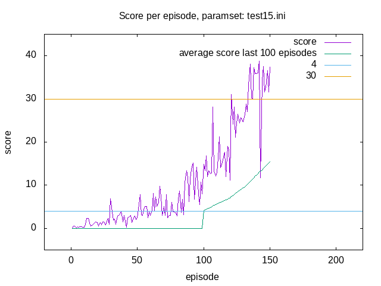

# Introduction
This project is going to be my (Matthias Schinacher) solution to a homework assignment for Udacity's Deep Reinforcement Learning Nano Degree.  
It contains mainly a python implementation of the DDPG- learning algorithm with replay-memory,
and a variation of priority reolay. The actor and critic functions (normal
and target) of the DDPG are neural networks implemented with pytorch.

# Project Details
The environment ist very similar to/ a variant of the "Reacher"
environment from Unity; [Unity ML-Agents GitHub](https://github.com/Unity-Technologies/ml-agents/blob/master/docs/Learning-Environment-Examples.md#Reacher).

In the environment an robotic arm agent is tasked with trying to stay in
a slowly moving spherical target area ("the green ball").

The agent is supposed to get a reward of 0.1 per time step and an episode
is 1000 time steps. The environment can be accessed via python/ has a python interface.
The state space is a vector of 33 numeric values (that represent the agents velocity,
location and so on).

The defined goal of the homework/ project is/was to achieve a "sustained" score of at least 30 per episode.
That means, that the algorithm/ the model should be able to average above score 30 for "the last 100 episodes"
over a number of episodes.

### Amendment 2018-12-18 (Version 3)
Because my 1st attempt did not yield the sustained 30 score goal, I made some adjustments.
Upon the advice of counsel, I modified my script to use the 20 Agents environment,
instead of the single agent environment.  
I ran some simulations with the 20 Agents variant, but could get nowhere near
the target 30 score still; I therefor abandonend the 20 Agents variant.  

I then modified the one agent variant of my script to use a more conventional
version of priority replay, not based on the actual rewards, but on the
"unexpectedness" of the transition. I also implemented a few additional flags
for the configuration, like flags whether or not to use priority replay at all
or use batch-norm layers or grad-norm clipping for the critic- optimization step.  
After again running a bunch of different configuration parameter sets through
the simulation I finally found a configuration that would yield the desired
target score (30). The configuration was one without without
batch-norm layers (I did not expect that, because I had read often, that
these layers would be essential) plus it would not "hold" the above 30 score for a number of
episodes.  
I then experimented with various configurations, that would use the before
mentioned one as pre-training (by loading the models and replay-buffer) but
change other parameters.
I was surprised to find, that a configuration without priority-replay
and without grad-norm clipping worked best and would yield a sustained score 30.

# Dependencies
The actual "program" (agent) is a python script that can be run from the command line.
To be able to run it, python 3.6 must be installed.

## Python packages
The following packages/ libraries are needed

- numpy, at least version 1.11.0
- torch, version 0.4.0 (pytorch)

## Other dependecies
A minimal install of OpenAI gym is required, as well as the classic control environment group
and the box2d environment group; instructions how to install this [can be found here](https://github.com/openai/gym).

Additionally one needs the "Reacher" environment from udacity, which was created for the course.
This can be downloaded [for Linux](https://s3-us-west-1.amazonaws.com/udacity-drlnd/P2/Reacher/one_agent/Reacher_Linux.zip)
(and other operating systems).

# Running the script/ program/ agent
To run the script from the command line (Linux), the dependencies mentioned must be installed and the contents
of the "Reacher_Linux.zip" need to be unzipped in the same directory, where the actual script "ms_drlndcc_pr.py"
resides, so that we have a subdirectory "Reacher_Linux".

    python ms_drlndcc_pr.py command-file.ini

will start the agent as per the parameters in the file "command-file.ini".
Depending on the contents of the command-file, the agent will try to solve the environment and train 
the neural networks that approximate the actor and critic functions of the DDPG
algorithm used. 
the script can load predefined NN- models from a files and only simulate
the Reacher- environment without learning. For more details see also the project- report.

## Parameters
### Amendment 2018-12-18 (Version 3)
Since the prio- replay is not based on rewards any longer and I implemented some
additional boolean config-parameters, there are some changes to the parameters.

### Old Parameters not in Version 3

- hyperparameters
    - replay prioritization
        - reward_gamma: reward- gamma discount factor
        - reward_offset: importance offset
        - no_reward_rm_prob: probability for transition with zero- reward to enter replay- memory

### Current 
- global
    - runlog: name of the logfile to use
- mode
    - train: whether we're in training mode
    - show: flag, whether to show  the simulation in "human time"
- rand
    - seed: seed for  random number generation
- model
    - h1: first size- parameter for the actor- NN- model
    - h2: second size- parameter for the actor-NN- model
    - c_h1: first size- parameter for the critic- NN- model
    - c_h2: second size- parameter for the critic-NN- model
    - batch_norm: whether to use batch norm layers (flag)
    - load_file: name- fragment for the files from which to load models (if any)
    - save_file: name- fragment for the files to save the models to
- hyperparameters
    - episodes: number of episodes to run:
    - warmup_episodes: epiosodes to run with pure random sampling
    - warmup_episodes_f: scale factor for pure random sampling
    - replay_buffersize: size of the replay memory
    - replay_batchsize: number of transitions to sample per optimizing step
    - replay_steps: simulation-steps between  each optimization run
    - optimizer_steps: no. of batch optimization-steps  per optimization run
    - learning_rate: the learning rate for the actor optimizer
    - learning_rate_c: the learning rate for the critic optimizer
    - gamma: DPPG gamma factor
    - grad_norm_clip: grad-norm clipping treshold for the critic (smaller 0.0 means no clipping)
    - prio_replay:  whether to use priority replay (flag)
    - tau: tau (soft target update)    - sample action noise
        - epsilon_start: start value for epsilon
        - epsilon_delta: value to subtract from epsilo  for each optimization step
        - epsilon_min: minimum/ final value for epsilon
        - noise_theta: theta for noise process
        - noise_sigma: sigma for noise process

### Example command-file contents

    [global]
    runlog = test15c4.log
    
    [mode]
    train = True
    show = False
    
    [rand]
    seed = 341919
    
    [model]
    h1         = 399
    h2         = 301
    c_h1       = 401
    c_h2       = 299
    save_file  = test15c4
    load_file  = test15
    batch_norm = False
    
    [hyperparameters]
    episodes           = 200
    warmup_episodes    = 0
    warmup_episodes_f  = 0.3
    replay_buffersize  = 100000
    replay_batchsize   = 128
    replay_steps       = 1
    gamma              = 0.99
    learning_rate      = 0.001
    learning_rate_c    = 0.0001
    optimizer_steps    = 1
    tau                = 0.001
    epsilon_start      = 0.4
    epsilon_delta      = 0.000001
    epsilon_min        = 0.3
    noise_theta        = 0.15
    noise_sigma        = 0.2
    grad_norm_clip     = -1.0
    prio_replay        = False

## Output
### Logfile
The main output is a log file which contains various information as within #- style comment lines
and the time-series data of
- Episode- number
- Score (at episode end)
- Minimum of all non zero rewards for a single step
- Maximum of rewards for a single step
- Size of replay buffer at episode end
- The epsilon at episode end

Example:

    # Episode Score average(last-100-Scores) MinReward MaxReward RMSize Epsilon
    1 0.0 0.0 0.0 0.0 403 -
    2 0.0 0.0 0.0 0.0 832 -
    ...
    146 2.5899999421089888 1.3216999704577028 0.009999999776482582 0.03999999910593033 60839 0.18469999999968467
    147 1.4499999675899744 1.3361999701336027 0.009999999776482582 0.03999999910593033 61270 0.18219999999968217
    148 2.389999946579337 1.3574999696575105 0.009999999776482582 0.03999999910593033 61715 0.17969999999967967
    149 2.5199999436736107 1.3801999691501259 0.009999999776482582 0.03999999910593033 62138 0.17719999999967717
    ...

# The solution (Version 1) - [actually was not a solution]
To my big disappointment, my agent did not reach the target score of 30.
I think however, that there is a bug in the environemt or a funny
dependency so that the rewards received are much smaller. I did NOT
observe a reward of 0.1 per time step, but my agent only got rewards
between 0.01 and 0.04 per time step.

Since the possible rewards per time step were much smaller, and if the simulation
is run in show mode with the models e.g. for the "test09.ini" command file
one can clearly see, that the agent has learned to stay in the target area,
my solution should be considered to be meeting the criteria.

The simulation run did yield a sustained score (last 100 episodes average)
of well above 4, and since the the rewards per time step were smaller than
promised by an order of magnitude, I consider the task solved.

## Graph

The "best" simulation run was the "test09" one, as can be seen in:

One should be able to replicate the result by running:

    python ms_drlndcc_pr.py test09.ini

See the actual project report for details.

# The solution (Version 3) - 2018-12-18
The first version of my implementation could not reach the target score of 30;
the second version (with 20 Agents) could not as well.

After altering the 1 agent variant again in some respects, I did find a
combination of parameters that resulted in the desired learning
(see "test15.ini"). It reached score 30 but not in a sustained fashion.
But when I use the resulting models as pretraining, a different set of
hyper- parameters ("test15c4.ini") will result in a sustained 30-score.

## Graph

One should be able to replicate the result by running:

    python ms_drlndcc_pr.py test15.ini

and after the first finished

    python ms_drlndcc_pr.py test15c4.ini

# Misc
## ZIP- archives
### INI.zip
Command files for the simulation runs.

### LOGS.zip
Log outputs of the simulation runs.

### GRAPHS.zip
Pictures created with gnuplot from the log-files and used for the project report.

### MODELS.zip
The NN- models resulting from the simulation runs.

#### Amendment 2018-12-18 (Version 3)
Additional ZIP- archives for the "version 3" solution are marked with "v3".

## See also
* report.pdf: the project report, contains additional information
